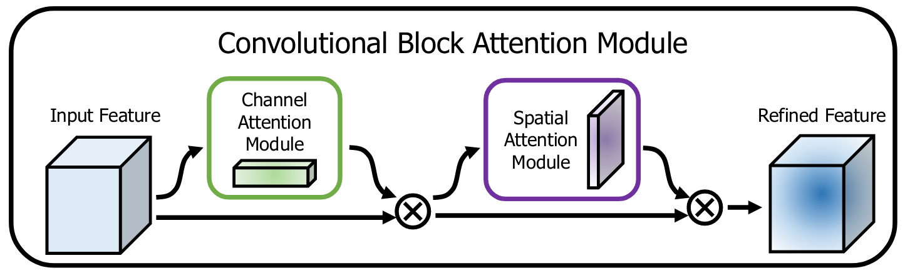
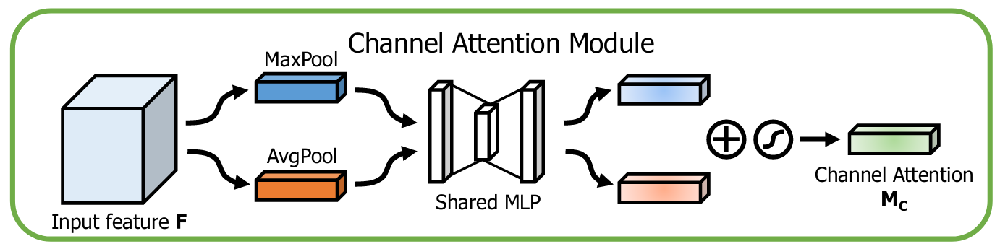
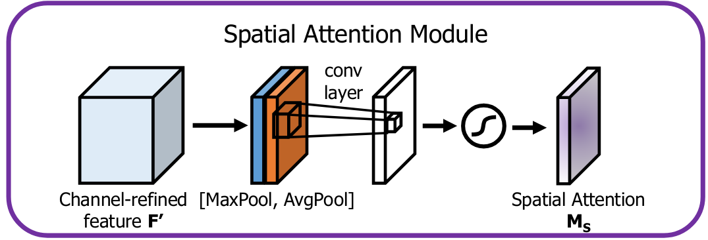
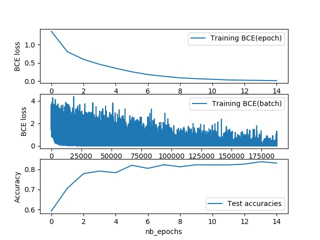

# CBAM: Convolutional Block Attention Module for CIFAR10 on ResNet backbone with Pytorch
This repository aims at reproducing the results from "[CBAM: Convolutional Block Attention Module](https://arxiv.org/abs/1807.06521)". We use the module coinjointly with the ResNet CNN architecture. The module is tested on the [CIFAR10](https://www.cs.toronto.edu/~kriz/cifar.html) dataset which is an image classification task with 10 different classes.

## CBAM module
The CBAM module takes as input a tensor of feature maps of shape Channel x Height x Width and apply two self-attention mechanisms consecutively. It is implemented in the **src/models/models/cbam.py** file.

    </img>
    <figcaption>Fig.1 - Full module taken from the original <a href="https://arxiv.org/abs/1807.06521">paper</a> .</figcaption>

The first attention mechanism is applied **channel-wise**, in that we want to select the channels (or features) that are the more relevant independently from any spatial considerations (ChannelAttention class).

    </img>

The second attention mechanism is applied along the two **spatial dimensions**. We want to select the more relevant locations in the feature maps independently from the channels (SpatialAttention class).

    </img>

This module is independant from the CNN architecture and can be used as is with other projects.

## ResNet

As the backbone, we use a Resnet implementation taken from [there](https://github.com/kuangliu/pytorch-cifar). The available networks are: **ResNet18,Resnet34, Resnet50, ResNet101 and ResNet152**. 

The **CBAM** module can be used **two different ways**:

It can be put in every blocks in the ResNet architecture, after the convolution part and before the residual part.

It can also be put at the end of the ResNet network, just before the Linear predictor. In that case it is used only for the final feature maps.

Both are available here in the file **src/models/models/cbam_cifar10.py**.

## Run the project

### Requirements
* Install [Anaconda](https://www.anaconda.com/)
* Create new environment from environment.yml using makefile: **make requirements**
* Activate environment: **conda activate myenv**

### Parameters
The parameters, set in the file **src/parameters/training.json** are the followings:

* **batch_size**: the batch size for training
* **lr**: the learning rate for training
* **momentum**: network is trained with SGD which requires momentum
* **batch_every**: how often to log batch results in terminal
* **n_epochs**: number of epochs for training
* **num_workers**: num of workers for the dataloader
* **model_name**: name used for saving losses charts and trained models
* **load_model**: trained model checkpoint path, if not the empty string then resume training from last trained epoch up to n_epochs. Checkpoint are stored in **src/reports/models/**
* **save_every**: how often to save the model in training (in epochs)
* **reduction_ratio**: reduction ratio for the channel attention bottleneck default to 16
* **kernel_cbam**: kernel for convolution in spatial attention must be an odd number
* **use_cbam_block**: if 1 put CBAM block in every ResNet Block
* **use_cbam_class**: if 1 put CBAM block before the classifier
* **resnet_depth**: Resnet type in [18,34,50,101,152]

Every time there is a new best model, it is automatically stored as checkpoint in **src/reports/models/** the file name includes "best" and " **model_name**.
Training and test losses are plotted and stored every epoch in **src/reports/losses/**. The file name includes the last epoch number and " **model_name**.

### Run
Once the parameters are selected, use the Makefile to start the training. The command line is: **python make train**.

### Restart training

* Set the parameter **load_model** as explained in the **Parameters** part.
* Set the number of epochs (**n_epochs**) which must be higher than the number of epochs the model was already trained on.
* Run.

## Evaluation
### Parameters

The parameters, set in the file **src/parameters/evaluation.json** are the followings:

* **model_path**: must be like "reports/models/model_name.pth" where model name is the name of the model to evaluate.
* **batch_size**: set the batch size for loading of the test set samples
* **num_workers**: num of workers for the dataloader

### Evaluate
* Set the model path
* Use the Makefile to start the training. The command line is: **python make evaluate**.

The corresponding accuracy on test set will be reported in the terminal.

## Results

The reported results are taken from three models:

* **ResNet18**: this is the standard **ResNet** architecture for **CIFAR10** with depth 18.
* **ResNet18CbamBlock**: this is the **ResNet** architecture with the **CBAM** module added in every block.
* **ResNet18CbamClass**: this is the **ResNet** architecture with the **CBAM** module added only before the classifier.

They were trained for 15 epochs with batch size 4 and kernel_cbam 3. Results can be found in the following table:

| Model         | Test Accuracy(%) | 
| ------------- |:-------------:|
| ResNet18      | Nan |
| ResNet18CbamBlock      | Nan      |
| ResNet18CbamClass | Nan    |

## Training curves
### ResNet18

    </img>

### ResNet18CbamBlock
### ResNet18CbamClass